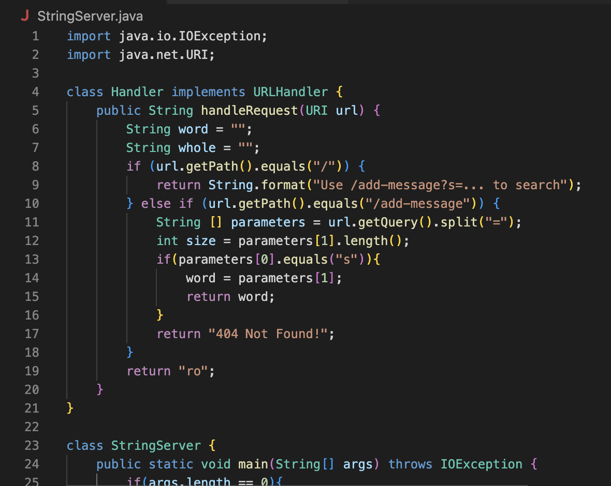
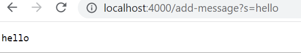

Part1                     
The code for StringServer:
                           
                               
Two screenshots of using ```/add-message``` :          
                         

