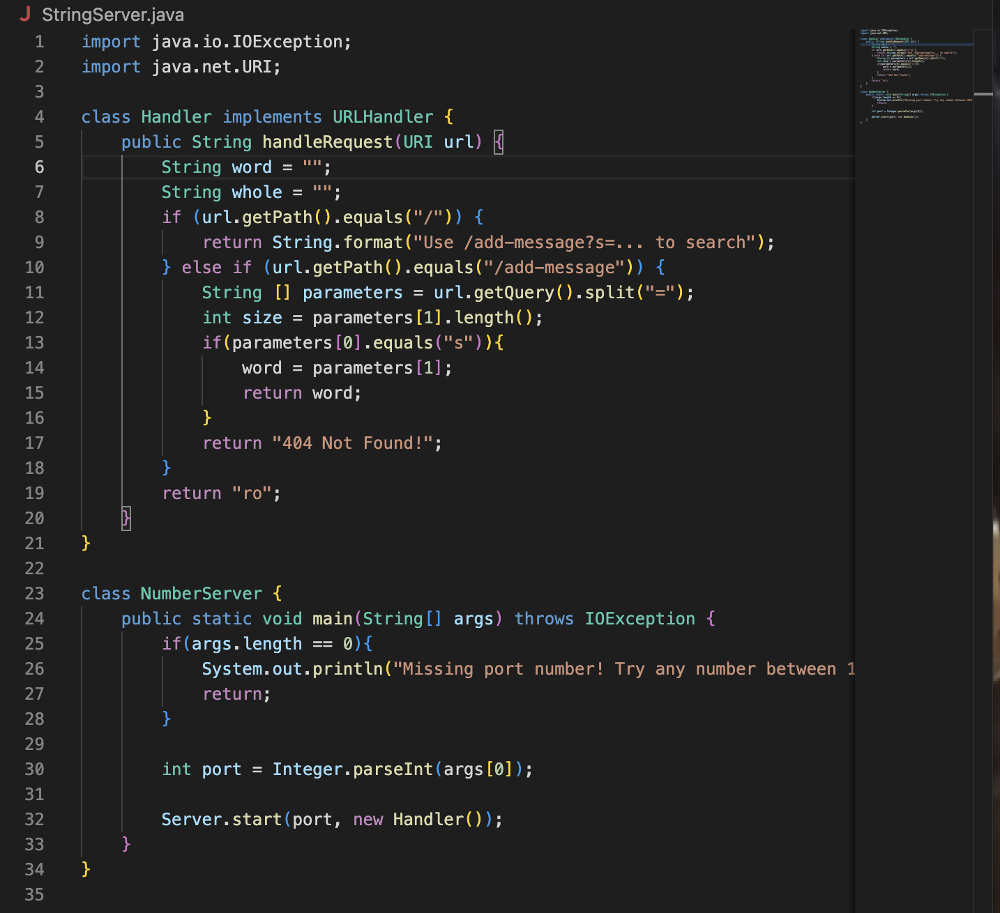

Part1                     
The code for StringServer:
                           
                               
Two screenshots of using ```/add-message``` :                                 
                                        

Method: handleRequest.                        
The relevant arguments are parameters and path.                       
```parameter[1]``` changed since it is related to the return output.

                  
Method: handleRequest.                      
The relevant arguments are parameters and path.                              
```parameter[1]``` changed since it is related to the return output.

                                                   
Part2                                 

