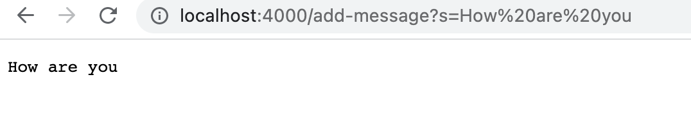

Part1                     
The code for StringServer:
                           
                               
Two screenshots of using ```/add-message``` :                                 
                                        

Method: handleRequest.                        
The relevant arguments are parameters and path.                       
```parameter[1]``` changed since it is related to the return output.

                  
Method: handleRequest.                      
The relevant arguments are parameters and path.                              
```parameter[1]``` changed since it is related to the return output.

                                                   
Part2                      
The bug, as the before-and-after code change required to fix it: 
The code below is two methods that I need to fixed: 
```
static void reverseInPlace(int[] arr) {
    for(int i = 0; i < arr.length; i += 1) {
      arr[i] = arr[arr.length - i - 1];
    }
  }
  static int[] reversed(int[] arr) {
    int[] newArray = new int[arr.length];
    for(int i = 0; i < arr.length; i += 1) {
      arr[i] = newArray[arr.length - i - 1];
    }
    return arr;
  }
```                   
The code below is the code I have fixed compare to the code above:
```
static void reverseInPlace(int[] arr) {
    for(int i = 0; i < arr.length/2; i += 1) {
      int temp = arr[i];
      arr[i] = arr[arr.length - i - 1];
      arr[arr.length - i - 1] = temp;
    }
  }
  static int[] reversed(int[] arr) {
    int[] newArray = new int[arr.length];
    for(int i = 0; i < arr.length; i += 1) {
      newArray[i] = arr[arr.length - i - 1];
    }
    return newArray;
  }
  ```
For the ```reverseInPlace(int[] arr)``` method, I divide ```arr.length``` by 2 in the first line of for loop and create a ```temp``` variable. The reason why I changed these code is to not letting the original array returned the same value in for loop again and again, and create the ```temp``` to temporarily holds the array in order to be replaced by another array.                                                           
For the ```reversed(int[] arr)``` method, the reason why I changed the ```arr[i] = newArray[arr.length - i - 1]``` to ```newArray[i] = arr[arr.length - i - 1]``` is that I need to create and return the new array, which is  ```newArray```, not the old one ```arr```. 
                                                         
Part3                      
In week2, I leanred how to build and run a server. In week3, I learned the difference code of Junit test for Mac users and Window users. Moreover, for the failure inducing input, we need to check it carefully on the for loop since it can be crashed even if there is a little mistake on the calculator. 
